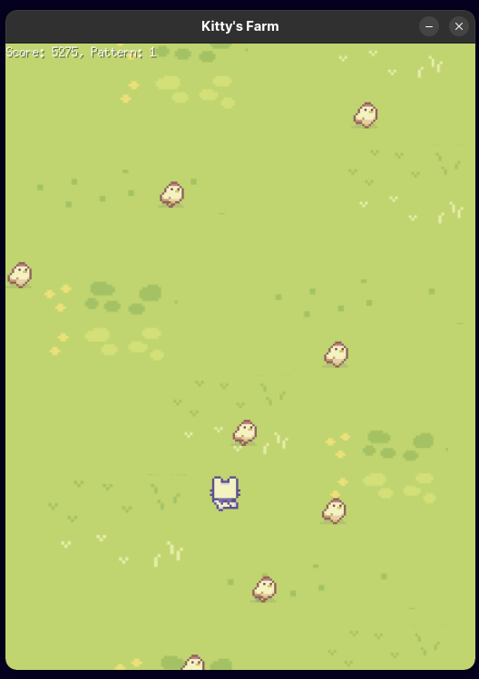

# Kitty's Farm
A simple 2D bullet-hell like game, written in Go using [Ebitengine](https://ebitengine.org/)

## Run the code
### Requirements
- [The Go programming language](https://go.dev/)
- [dependencies](https://www.markdownguide.org/cheat-sheet/)
- Clone the repo
- Run ` go mod tidy `
- Execute ` go run . `
